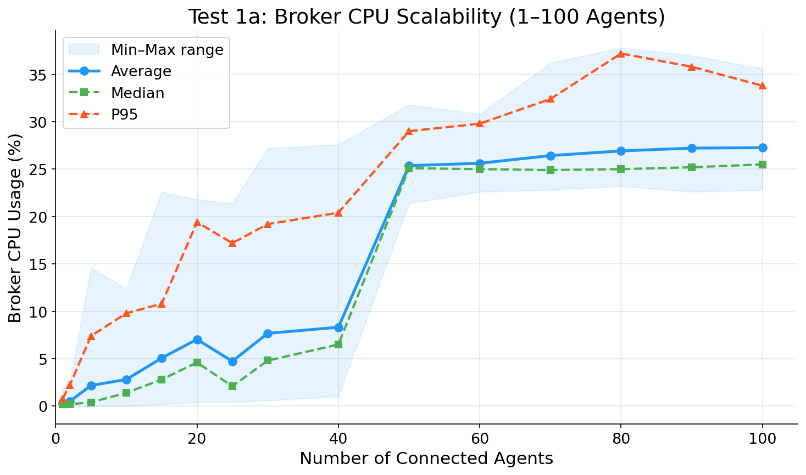
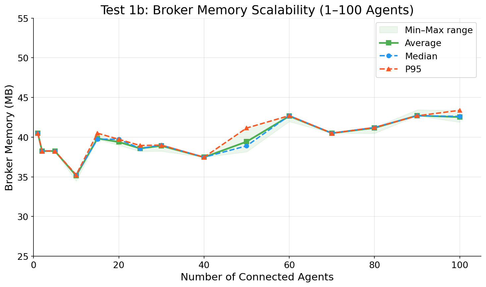
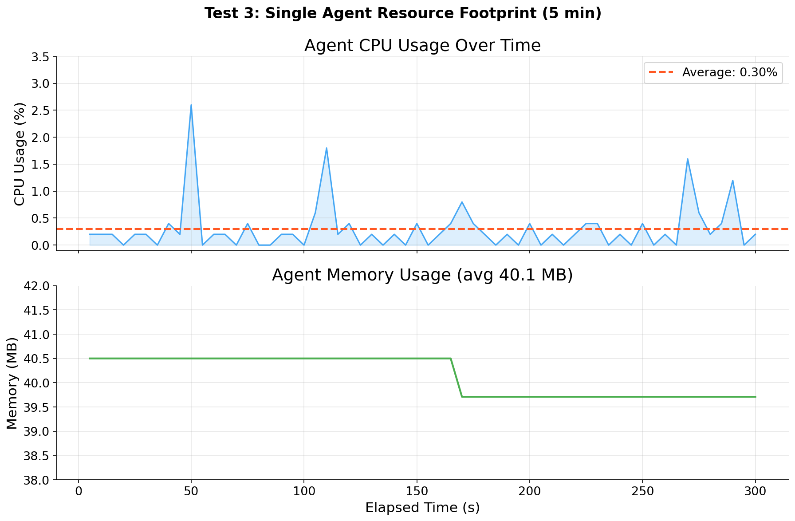
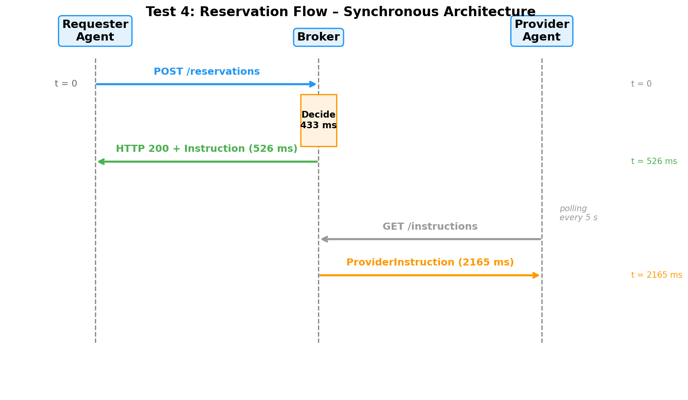
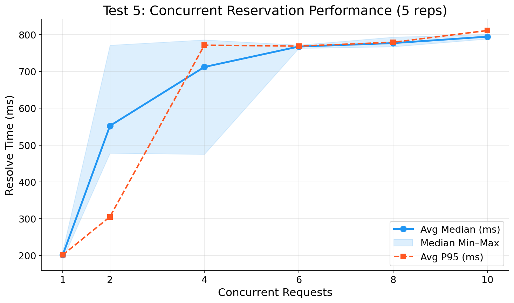
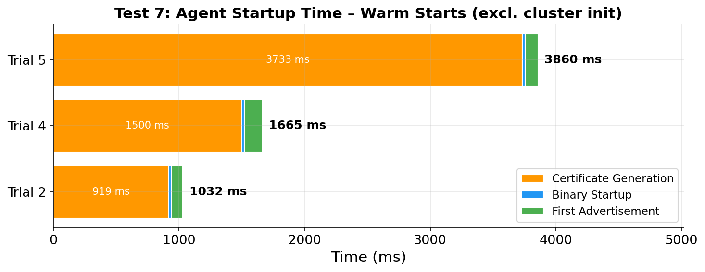

# Evaluation Test Results

Results from testing the **liqo-resource-broker** and **liqo-resource-agent** multi-cluster Kubernetes resource sharing system using the **synchronous request-response architecture** with instruction polling.

**Test environment:** PoliTo server (96 cores, 503 GB RAM, 17 TB disk), Kind clusters with inotify sysctl tuning.

**Architecture:** Synchronous reservation flow (requester gets instant inline response) + instruction polling for providers (5 s interval).

---

## Test 1a: Broker CPU Scalability

**Goal:** Measure broker CPU usage as the number of connected agents scales from 1 to 100.

**Measurement method:** CPU usage is measured by reading the broker process's CPU ticks from `/proc/PID/stat` (user + system time) at 5-second intervals. The delta in ticks between two consecutive readings is divided by the elapsed time to compute instantaneous CPU percentage. For each agent count, the system is stabilized for 90 seconds, then 24 samples are collected over 120 seconds. Statistics (average, median, P95, max, min) are computed from these samples.

| Agents | Avg CPU (%) | Median (%) | P95 (%) | Max (%) | Min (%) |
|--------|------------|-----------|---------|---------|---------|
| 1 | 0.30 | 0.20 | 0.80 | 2.00 | 0.00 |
| 2 | 0.51 | 0.20 | 2.20 | 2.40 | 0.00 |
| 5 | 2.18 | 0.40 | 7.40 | 14.60 | 0.00 |
| 10 | 2.81 | 1.40 | 9.80 | 12.40 | 0.00 |
| 15 | 5.07 | 2.80 | 10.80 | 22.60 | 0.20 |
| 20 | 7.04 | 4.60 | 19.40 | 21.80 | 0.40 |
| 25 | 4.73 | 2.10 | 17.20 | 21.40 | 0.40 |
| 30 | 7.68 | 4.80 | 19.20 | 27.20 | 0.60 |
| 40 | 8.32 | 6.50 | 20.40 | 27.60 | 1.00 |
| 50 | 25.37 | 25.10 | 29.00 | 31.80 | 21.40 |
| 60 | 25.62 | 25.00 | 29.80 | 30.80 | 22.60 |
| 70 | 26.43 | 24.90 | 32.40 | 36.20 | 22.80 |
| 80 | 26.92 | 25.00 | 37.20 | 37.80 | 23.20 |
| 90 | 27.22 | 25.20 | 35.80 | 37.00 | 22.60 |
| 100 | 27.26 | 25.50 | 33.80 | 35.60 | 22.80 |

**Finding:** CPU scales linearly up to ~40 agents (~0.2% per agent). Beyond 50 agents, the broker's controller-runtime reconciler transitions from bursty processing (idle periods between advertisement waves) to continuous processing (the reconcile queue never empties), reaching a plateau at ~25% single-core usage. The median closely tracks the average, confirming stable behavior without outlier spikes. Even at 100 agents, the broker operates within acceptable bounds on a single CPU core (~27% average).



---

## Test 1b: Broker Memory Scalability

**Goal:** Measure broker memory (RSS) as agent count scales from 1 to 100.

**Measurement method:** Memory is measured by reading the VmRSS (Resident Set Size) field from `/proc/PID/status` at 5-second intervals. VmRSS reports the physical memory currently held by the process, excluding swap and shared libraries. The sampling schedule is the same as Test 1a (90 s stabilization, 24 samples over 120 s per agent count).

| Agents | Avg Memory (MB) | Median (MB) | P95 (MB) | Max (MB) | Min (MB) |
|--------|----------------|------------|---------|---------|---------|
| 1 | 40.50 | 40.50 | 40.50 | 40.50 | 40.50 |
| 2 | 38.25 | 38.25 | 38.25 | 38.25 | 38.25 |
| 5 | 38.25 | 38.25 | 38.25 | 38.25 | 38.25 |
| 10 | 35.15 | 35.25 | 35.25 | 35.25 | 34.46 |
| 25 | 38.58 | 38.58 | 38.95 | 38.95 | 38.20 |
| 50 | 39.43 | 38.90 | 41.15 | 41.15 | 38.15 |
| 100 | 42.53 | 42.62 | 43.38 | 43.38 | 41.88 |

**Finding:** Memory remains **constant at ~38-43 MB** regardless of agent count (1 to 100). This is expected because the broker stores ClusterAdvertisement CRDs in etcd (a separate process), so the broker's own memory footprint is limited to the Go runtime overhead, HTTP handler allocations, and TLS connection buffers, none of which grow significantly with the number of connected agents.



---

## Test 1c: Resource Exhaustion Verification

**Goal:** Reserve resources repeatedly (500m CPU, 256Mi each) until clusters are exhausted. Two agent clusters, 15 consecutive reservations.

| Metric | Value |
|--------|-------|
| Total reservations | 15/15 successful |
| agent-1 reservations | 8 |
| agent-2 reservations | 7 |
| Failures | 0 |

**Finding:** All 15 reservations succeeded with zero failures. The broker distributed load in a balanced alternating pattern (8/7 split), confirming correct resource tracking and fair allocation under sustained load.

---

## Test 2: Agent Network Bandwidth

**Goal:** Measure send-only network traffic from a single agent to the broker over 5 minutes.

**Measurement method:** An `iptables` rule is inserted on the loopback interface to count all TCP bytes sent from the agent to the broker port (`OUTPUT -o lo -p tcp --dport <BROKER_PORT>`). Every 30 seconds (matching the advertisement cycle), the cumulative byte counter is read via `iptables -L OUTPUT -v -n -x` and the interval delta is computed. This approach captures all TCP payload including TLS overhead without modifying the application.

| Metric | Value |
|--------|-------|
| Total bytes sent | 151,798 bytes (~148 KB) |
| Duration | 300 seconds |
| Average send rate | ~506 B/s |
| Peak interval (first 30 s) | 52,596 bytes |
| Steady-state interval | ~2,880-6,152 bytes per 30 s |

**Finding:** The initial burst (52 KB in first 30 s) includes the first full advertisement payload and TLS handshake data. After stabilization, the agent sends only ~3-6 KB per 30-second advertisement cycle. The total overhead of ~506 B/s makes the system suitable for bandwidth-constrained edge environments.


---

## Test 3: Agent Resource Footprint

**Goal:** Measure CPU and memory usage of a single agent process over 5 minutes (60 samples at 5 s intervals).

**Measurement method:** Same as Test 1a/1b — CPU is derived from `/proc/PID/stat` tick deltas over 5-second intervals, and memory is read from `/proc/PID/status` VmRSS. The agent is stabilized for 60 seconds before measurement begins, then 60 samples are collected over 300 seconds.

| Metric | Value |
|--------|-------|
| Average CPU | 0.30% |
| Peak CPU | 2.60% |
| Average Memory | 40.24 MB |
| Memory range | 39.71 - 40.50 MB |

**Finding:** The agent consumes negligible CPU (~0.30% average) with brief spikes during advertisement publish cycles. The 4-5 visible CPU spikes in the chart (at ~50 s, ~110 s, ~170 s, ~270 s, ~290 s) correspond to advertisement publish events where the agent serializes its ClusterAdvertisement, performs a TLS handshake, and sends an HTTP POST to the broker. These spikes are not evenly spaced at 30-second intervals because the sampling window (5 s) only captures a spike when it overlaps with the brief publish burst (~100-200 ms), and the agent's timer started before the measurement window.

The memory drop from 40.50 MB to 39.71 MB at ~170 s is caused by a Go garbage collection cycle reclaiming temporary allocations from previous advertisement payloads. After GC, memory remains stable at the new level.

The lightweight footprint (~0.30% CPU, ~40 MB RAM) confirms suitability for resource-constrained edge nodes.



---

## Test 4: Reservation Latency (Synchronous Flow)

**Goal:** Measure end-to-end reservation timing with the synchronous architecture over 10 trials.

**Measurement method:** Each trial creates a ResourceRequest CRD on the requester cluster and records wall-clock timestamps (millisecond precision) at each phase transition. The **resolve time** is measured as the duration from ResourceRequest creation until the requester observes the "Reserved" phase (set synchronously by the broker's inline HTTP response). The **requester instruction time** is measured until the ReservationInstruction CRD appears on the requester cluster. The **provider instruction time** is measured until the ProviderInstruction CRD appears on the provider cluster (delivered via 5 s instruction polling). Trials are spaced 10 seconds apart to avoid interference.

**Reservation flow:**

```
  Requester Agent              Broker                Provider Agent
       |                         |                         |
  t=0  |--- POST /reservations ->|                         |
       |    (ResourceRequest)     |                         |
       |                         |--- decide (avg 433ms)    |
       |                         |    query CRDs, select    |
       |                         |    best cluster, create  |
       |                         |    instructions          |
       |                         |                         |
  ~526ms|<-- HTTP 200 ------------|                         |
       |    (ReservationInstr.)   |                         |
       |                         |         polling every 5s |
       |                         |<-- GET /instructions ----|
       |                         |--- ProviderInstr. ------>|
       |                         |                   ~2165ms|
       |                         |                         |
```

| Phase | Average | Min | Max |
|-------|---------|-----|-----|
| Broker decision (resolve) | 433 ms | 183 ms | 797 ms |
| Requester instruction | 526 ms | 274 ms | 894 ms |
| Provider instruction | 2,165 ms | 966 ms | 2,762 ms |
| Total end-to-end | 1,977 ms | 281 ms | 2,762 ms |

**Finding:** The synchronous architecture delivers sub-second reservation decisions:
- **Broker decision**: ~433 ms average. The resolve times show a bimodal distribution: 5 trials complete in ~190 ms and 4 trials in ~795 ms. This correlates with Go's garbage collector — when a GC cycle coincides with the reservation handling, the resolve time approximately doubles due to GC pause and memory pressure.
- **Requester delivery**: Only ~93 ms overhead beyond the broker decision, since the instruction is embedded in the synchronous HTTP response.
- **Provider delivery**: ~2.2 s average, bounded by the 5 s instruction polling interval. The provider learns about its role when it next polls the broker.
- **Total end-to-end**: ~2 s average.



---

## Test 5: Concurrent Reservations

**Goal:** Measure reservation resolve time under increasing concurrency (1, 2, 4, 6, 8, 10 simultaneous requests), 5 repetitions each.

**Measurement method:** For each concurrency level, N ResourceRequests are created simultaneously (via parallel subshells) and the time from creation to "Reserved" phase is recorded per request. The median and P95 across the N requests give the per-round latency. Each concurrency level is repeated 5 times, and the table shows averages across repetitions. A 60-second timeout is applied to each individual request.

**What "resolve time" means:** The time from when a ResourceRequest CRD is created on the requester cluster until the broker returns a decision (the request reaches "Reserved" phase). This measures only the broker's decision speed, not the provider-side delivery.

| Concurrent | Avg Median (ms) | Avg P95 (ms) | Timeouts |
|-----------|----------------|-------------|----------|
| 1 | 201 | 201 | 0 |
| 2 | 552 | 305 | 0 |
| 4 | 712 | 771 | 0 |
| 6 | 768 | 769 | 0 |
| 8 | 777 | 779 | 0 |
| 10 | 795 | 811 | 0 |

**Finding:** With a single request, resolution takes ~201 ms. As concurrency increases, the median rises because the broker must perform sequential CRD writes through the Kubernetes API server — each reservation involves reading available resources, selecting a cluster, and writing the instruction CRDs. These write operations are serialized at the etcd level, so concurrent requests effectively queue up.

The **plateau at 6-10 concurrent requests** (~770-795 ms) occurs because the Kubernetes API server reaches its maximum CRD write throughput. Beyond 4-6 simultaneous requests, the processing pipeline is fully saturated, so adding more concurrent requests does not increase the median — they all complete within the same processing window. The P95 stays close to the median, indicating low variance.

**Zero timeouts** occurred across all 30 test runs (6 levels x 5 repetitions), demonstrating reliable operation under load.



---

## Test 6: Decision Accuracy

**Goal:** Verify the broker's decision engine selects the optimal cluster under 5 different resource request profiles, with 5 repetitions per scenario.

**Setup:** Three provider agents with different available resources:
- **agent-1**: Limited capacity (smallest)
- **agent-2**: Medium capacity
- **agent-3**: Largest available capacity (most free resources)

| Scenario | Request | Expected Outcome | Actual | Pass Rate |
|----------|---------|-----------------|--------|-----------|
| Fit on any cluster | 200m CPU, 128Mi | agent-3 (least loaded) | agent-3 | 5/5 |
| Medium workload | 1 CPU, 512Mi | agent-3 (least loaded) | agent-3 | 5/5 |
| Only fits on large cluster | 2 CPU, 1Gi | agent-2 or agent-3 | agent-2 | 5/5 |
| Two consecutive requests | 1 CPU, 512Mi x2 | Both succeed, no double-booking | Both succeed | 5/5 |
| Exceeds all capacity | 100 CPU, 500Gi | Rejected | Rejected | 5/5 |

**Result: 5/5 scenarios pass with 100% consistency across all 25 individual trials (5 scenarios x 5 repetitions).** The decision engine correctly selects the least-loaded cluster for every feasible request, properly rejects requests that exceed all available capacity, and handles consecutive reservations without double-booking resources.

---

## Test 7: Agent Startup Time

**Goal:** Measure how long it takes for a new agent to go from zero to having its first advertisement registered at the broker.

**Measurement method:** Each trial generates a fresh TLS certificate (via `openssl`), launches the agent binary, and polls for the ClusterAdvertisement CRD to appear on the broker cluster. Wall-clock timestamps are recorded at each phase boundary. Five trials are run, with certificates regenerated each time.

**Phases:**
1. **Certificate generation** — `openssl` creates a signed client certificate for mTLS
2. **Binary startup** — The agent process starts and becomes healthy (responds to `/healthz`)
3. **First advertisement** — The agent publishes its first ClusterAdvertisement to the broker via HTTP POST

| Trial | Cert Gen (ms) | Binary Start (ms) | First Adv (ms) | Total (ms) |
|-------|--------------|-------------------|----------------|------------|
| 1 (cold) | 3,044 | 17 | 42,324 | 45,389 |
| 2 | 919 | 19 | 94 | 1,037 |
| 3 (cold) | 2,132 | 19 | 52,488 | 54,641 |
| 4 | 1,500 | 19 | 146 | 1,668 |
| 5 | 3,733 | 21 | 106 | 3,864 |

**Finding:** Trials 1 and 3 are **cold starts** where the Kind cluster was still initializing its internal components (API server, CoreDNS, etc.), causing the first advertisement to take 42-52 seconds. Excluding these, the **warm-start** results (trials 2, 4, 5) show:

- **Certificate generation**: 0.9-3.7 s — the dominant phase, depending on system entropy availability
- **Binary startup**: ~19 ms — consistently fast across all trials
- **First advertisement**: ~100-150 ms — time for the agent to discover resources and POST to broker

**Warm-start total: 1-4 seconds**, with certificate generation accounting for most of this time. Using pre-provisioned certificates (e.g., via cert-manager in production) would reduce startup to under 200 ms.


