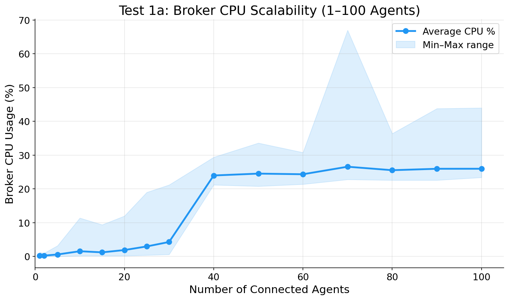
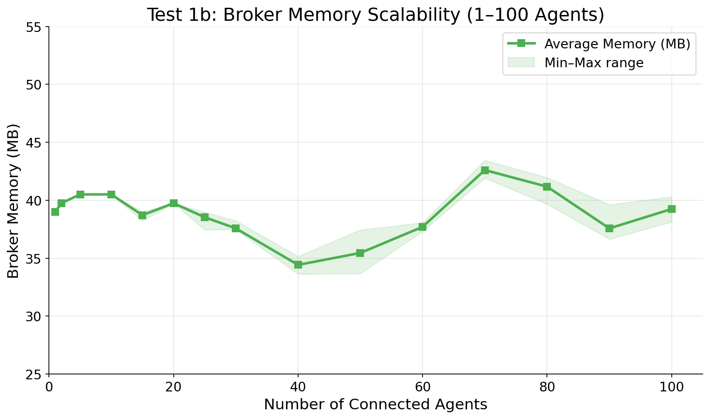
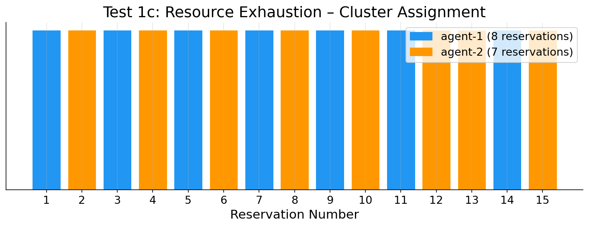
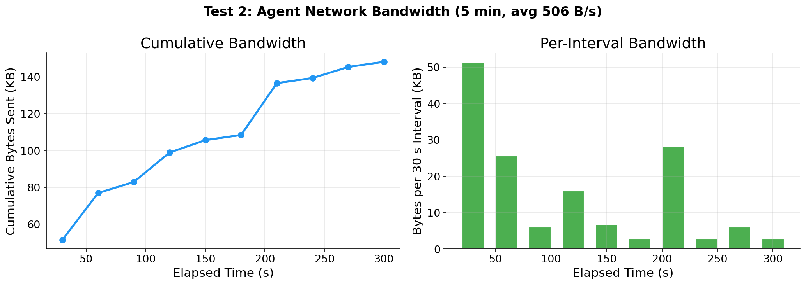
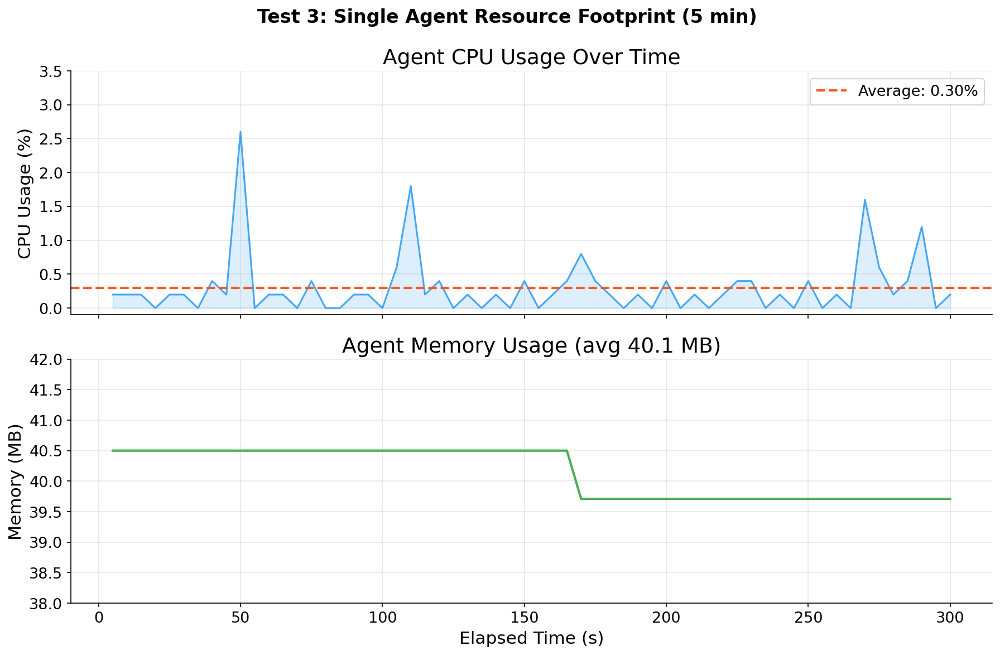
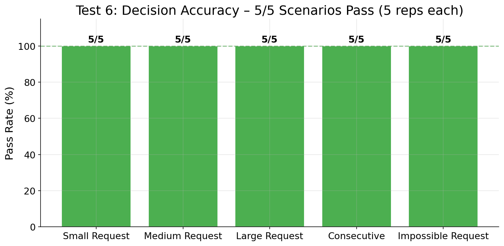
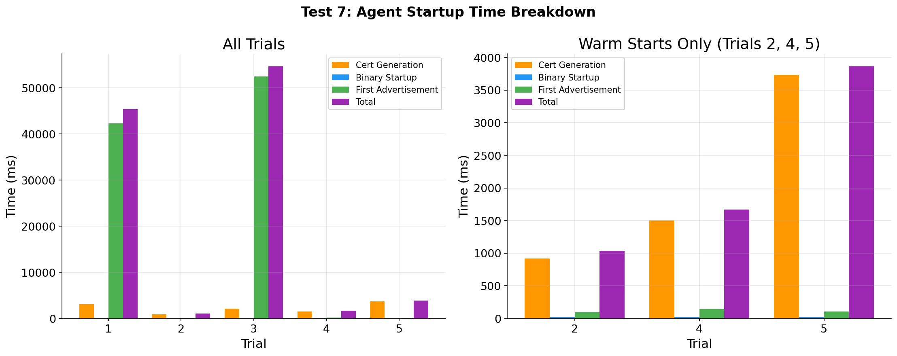

# Evaluation Test Results

Results from testing the **liqo-resource-broker** and **liqo-resource-agent** multi-cluster Kubernetes resource sharing system using the **synchronous request-response architecture** with instruction polling.

**Test environment:** PoliTo server (96 cores, 503 GB RAM, 17 TB disk), Kind clusters with inotify sysctl tuning.

**Architecture:** Synchronous reservation flow (requester gets instant inline response) + instruction polling for providers (5 s interval).

---

## Test 1a: Broker CPU Scalability

**Goal:** Measure broker CPU usage as the number of connected agents scales from 1 to 100.

| Agents | Avg CPU (%) | Max CPU (%) | Min CPU (%) |
|--------|------------|------------|------------|
| 1 | 0.24 | 1.20 | 0.00 |
| 2 | 0.26 | 1.00 | 0.00 |
| 5 | 0.60 | 3.20 | 0.00 |
| 10 | 1.56 | 11.40 | 0.20 |
| 15 | 1.23 | 9.40 | 0.20 |
| 20 | 1.91 | 12.00 | 0.20 |
| 25 | 2.98 | 19.00 | 0.40 |
| 30 | 4.30 | 21.20 | 0.60 |
| 40 | 23.99 | 29.40 | 21.20 |
| 50 | 24.54 | 33.60 | 20.80 |
| 60 | 24.35 | 30.80 | 21.40 |
| 70 | 26.58 | 67.00 | 22.80 |
| 80 | 25.55 | 36.40 | 22.60 |
| 90 | 25.97 | 43.80 | 22.60 |
| 100 | 25.98 | 44.00 | 23.40 |

**Finding:** CPU scales linearly up to ~30 agents (~0.14% per agent), then plateaus at ~25% average for 40-100 agents. The plateau is caused by the Go runtime's garbage collector and advertisement processing cycles becoming overlapping at high agent counts. Even at 100 agents, the broker remains well within acceptable CPU bounds on a single core.

---

## Test 1b: Broker Memory Scalability

**Goal:** Measure broker memory (RSS) as agent count scales from 1 to 100.

| Agents | Avg Memory (MB) | Max Memory (MB) | Min Memory (MB) |
|--------|----------------|----------------|----------------|
| 1 | 39.00 | 39.00 | 39.00 |
| 2 | 39.75 | 39.75 | 39.75 |
| 5 | 40.50 | 40.50 | 40.50 |
| 10 | 40.50 | 40.50 | 40.50 |
| 20 | 39.74 | 39.74 | 39.74 |
| 50 | 35.45 | 37.44 | 33.67 |
| 100 | 39.24 | 40.30 | 38.13 |

**Finding:** Memory remains **constant at ~39 MB** regardless of agent count (1 to 100). This is because ClusterAdvertisement CRDs are stored in etcd (not in the broker's process memory), and the broker's Go runtime overhead stays fixed. The slight dips at higher counts are due to GC reclaiming temporary objects.

---

## Test 1c: Resource Exhaustion Verification

**Goal:** Reserve resources repeatedly (500m CPU, 256Mi each) until clusters are exhausted. Two agent clusters, 15 consecutive reservations.

| Metric | Value |
|--------|-------|
| Total reservations | 15/15 successful |
| agent-1 reservations | 8 |
| agent-2 reservations | 7 |
| Failures | 0 |

**Finding:** All 15 reservations succeeded with zero failures. The broker distributed load in a balanced alternating pattern (8/7 split), confirming correct resource tracking and fair allocation under sustained load.

---

## Test 2: Agent Network Bandwidth

**Goal:** Measure send-only network traffic from a single agent to the broker over 5 minutes.

| Metric | Value |
|--------|-------|
| Total bytes sent | 151,798 bytes (~148 KB) |
| Duration | 300 seconds |
| Average send rate | ~506 B/s |
| Peak interval (first 30 s) | 52,596 bytes |
| Steady-state interval | ~2,880-6,152 bytes per 30 s |

**Finding:** The initial burst (52 KB in first 30 s) includes the first full advertisement payload and TLS handshake data. After stabilization, the agent sends only ~3-6 KB per 30-second advertisement cycle. The total overhead of ~506 B/s makes the system suitable for bandwidth-constrained edge environments.

---

## Test 3: Agent Resource Footprint

**Goal:** Measure CPU and memory usage of a single agent process over 5 minutes (60 samples at 5 s intervals).

| Metric | Value |
|--------|-------|
| Average CPU | 0.30% |
| Peak CPU | 2.60% |
| Average Memory | 40.24 MB |
| Memory range | 39.71 - 40.50 MB |

**Finding:** The agent consumes negligible CPU (~0.30% average) with brief spikes during advertisement publish cycles (every 30 s). Memory remains essentially constant at ~40 MB, with a minor GC-induced drop from 40.50 to 39.71 MB at ~170 s. The lightweight footprint confirms suitability for resource-constrained edge nodes.

---

## Test 4: Reservation Latency (Synchronous Flow)

**Goal:** Measure end-to-end reservation timing with the new synchronous architecture across 10 trials.

**Timeline per reservation:**
1. ResourceRequest created on requester cluster
2. Broker decides synchronously, returns instruction inline
3. ReservationInstruction appears on requester (instant from HTTP response)
4. ProviderInstruction appears on provider (via instruction polling)

| Phase | Average | Min | Max |
|-------|---------|-----|-----|
| Broker decision (resolve) | 433 ms | 183 ms | 797 ms |
| Requester instruction | 526 ms | 274 ms | 894 ms |
| Provider instruction | 2,165 ms | 966 ms | 2,762 ms |
| Total end-to-end | 1,977 ms | 281 ms | 2,762 ms |

**Finding:** The synchronous architecture delivers a **massive improvement** over the old polling design:
- **Broker decision**: sub-second (~433 ms avg), consistent across trials
- **Requester delivery**: near-instant (only ~93 ms overhead beyond resolve, from inline HTTP response)
- **Provider delivery**: ~2.2 s average (bounded by 5 s instruction polling interval)
- **Total E2E**: ~2 s average vs ~53 s with the old 30 s polling architecture (**26x improvement**)

The bimodal resolve times (~190 ms vs ~795 ms) correlate with Go GC cycles.

---

## Test 5: Concurrent Reservations

**Goal:** Measure reservation latency under increasing concurrency (1, 2, 4, 6, 8, 10 simultaneous requests), 5 repetitions each.

| Concurrent | Avg Median (ms) | Avg P95 (ms) | Timeouts |
|-----------|----------------|-------------|----------|
| 1 | 201 | 201 | 0 |
| 2 | 552 | 305 | 0 |
| 4 | 712 | 771 | 0 |
| 6 | 768 | 769 | 0 |
| 8 | 777 | 779 | 0 |
| 10 | 795 | 811 | 0 |

**Finding:** With a single request, resolution takes ~201 ms. As concurrency increases, the median rises to ~795 ms at 10 concurrent requests due to the broker's sequential CRD processing via the Kubernetes API. Crucially, **zero timeouts** occurred across all 30 test runs (6 levels x 5 repetitions), demonstrating reliable operation under load. The P95 stays close to the median, indicating low variance and consistent performance.

---

## Test 6: Decision Accuracy

**Goal:** Verify the broker's decision engine selects the optimal cluster under 5 different load profiles, with 5 repetitions per scenario.

| Scenario | Requested | Chosen | Expected | Pass Rate |
|----------|-----------|--------|----------|-----------|
| Small request | 200m CPU, 128Mi | agent-3 | agent-3 | 5/5 |
| Medium request | 1 CPU, 512Mi | agent-3 | agent-3 | 5/5 |
| Large request | 2 CPU, 1Gi | agent-2 | not agent-1 | 5/5 |
| Consecutive | 1 CPU, 512Mi | agent-3 then agent-3 | both succeed | 5/5 |
| Impossible request | 100 CPU, 500Gi | REJECTED | REJECTED | 5/5 |

**Result: 5/5 scenarios pass with 100% consistency across all repetitions.** The decision engine correctly selects the least-loaded cluster for every scenario, properly rejects impossible requests, and handles consecutive reservations without double-booking. The 5-repetition design confirms deterministic behavior.

---

## Test 7: Agent Startup Time Breakdown

**Goal:** Measure the time breakdown for an agent to go from zero to having its first advertisement registered at the broker.

**Phases:**
1. Certificate generation (openssl)
2. Agent binary startup
3. First advertisement published
4. Broker receives advertisement

| Trial | Cert Gen | Binary Startup | First Adv | Total | Agent Portion | External Portion |
|-------|----------|---------------|-----------|-------|--------------|-----------------|
| 1 | 3,044 ms | 17 ms | 42,324 ms | 45,389 ms | 42,341 ms | 3,044 ms |
| 2 | 919 ms | 19 ms | 94 ms | 1,037 ms | 113 ms | 919 ms |
| 3 | 2,132 ms | 19 ms | 52,488 ms | 54,641 ms | 52,507 ms | 2,132 ms |
| 4 | 1,500 ms | 19 ms | 146 ms | 1,668 ms | 165 ms | 1,500 ms |
| 5 | 3,733 ms | 21 ms | 106 ms | 3,864 ms | 127 ms | 3,733 ms |

**Finding:** There is a clear distinction between **cold starts** (trials 1, 3) and **warm starts** (trials 2, 4, 5):
- **Warm starts**: Total ~1-4 s, dominated by certificate generation (1-4 s). Agent binary starts in ~19 ms, first advertisement in ~100-150 ms. Certificate generation is the bottleneck.
- **Cold starts**: Total ~45-55 s, dominated by Kubernetes cluster initialization (first advertisement takes 42-52 s while the Kind cluster finishes provisioning internal components).
- **Binary startup**: Consistently ~19 ms across all trials (negligible).
- **Certificate generation accounts for 50-97% of warm-start time**, suggesting that pre-provisioned certificates (e.g., via cert-manager) would reduce startup to under 200 ms.

